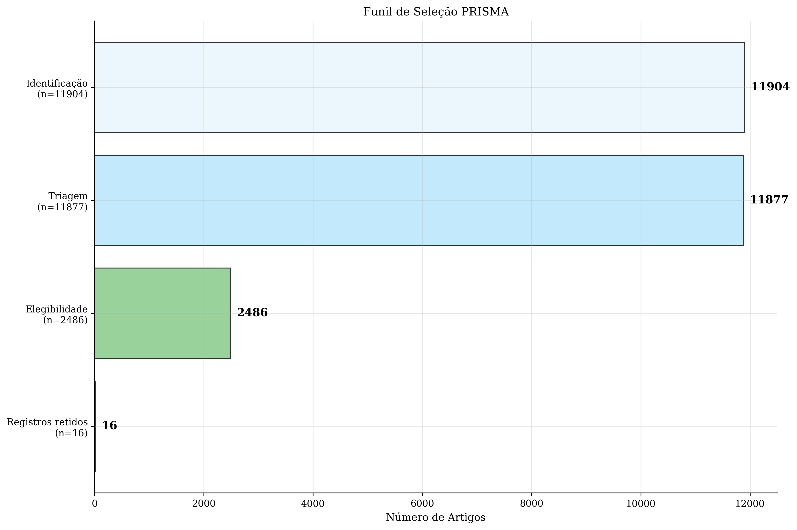

# Auditoria Completa dos Números PRISMA — Verificação Detalhada

## Estado vigente (31/08/2026)

O banco atual contém **11.904 registros brutos**. Após a deduplicação
determinística de **27 registros por DOI/URL**, o fluxo conta **11.877** na
triagem, **9.391** excluídos, **2.486** avançando à elegibilidade, **2.470**
excluídos nessa etapa e **16** registros retidos operacionalmente. Desses, 15
são registros classificados provisoriamente como empíricos e o ID 6921 é um protocolo/proposta mantido apenas para
contexto e rastreabilidade, fora da síntese empírica. Os 15 registros empíricos
são classificados provisoriamente até a conclusão das fontes e da adjudicação.
Os IDs retidos são 1--10,
6916, 6917, 6918, 6920, 6921 e 6923.

A execução histórica tinha 17 estudos incluídos. Em uma nova rodada, foram identificados 23 candidatos e aplicados 7 overrides manuais, chegando aos 16 registros retidos operacionais. A diferença também envolve nova contagem de ingestão e correção do scoring; não é uma simples troca numérica. Para a interpretação, há 15 registros classificados provisoriamente como empíricos; o ID 6918 permanece em hold por conflito temporal, e o ID 6921 é contextual, sem resultados empíricos e sem aplicação do MMAT empírico. A reavaliação documental do MMAT aos registros aplicáveis foi registrada com decisões e evidências por critério; nove textos primários foram revisados externamente, enquanto fontes, localizadores, adjudicação e conclusão final permanecem pendentes. Quatro overrides (14, 6915, 6919 e 6925) exigem adjudicação de fonte primária/escopo; portanto, não são exclusões científicas finais.




As figuras acima representam o snapshot operacional vigente. As remoções por DOI
ou URL são decisões determinísticas de identidade de registro. A auditoria bruta
encontrou 257 excedentes em grupos de título; depois da remoção DOI/URL, 232
excedentes permanecem apenas por título em auditoria e não alteram o fluxo sem
disposição semântica rastreável.

## Baseline histórico auditado
> **Aviso de versão:** este documento registra a auditoria do baseline histórico de 9.431 registros e 17 incluídos. Após a atualização do banco em 31/08/2026, a fonte atual é `docs/RECONCILIACAO-BASELINE-2026-08-31.md`, com 11.904 registros consolidados e 16 incluídos. Os valores abaixo devem ser lidos como histórico, não como contagens vigentes.

**Data**: 29 de março de 2026
**Projeto**: Ensino Personalizado de Matemática: Oportunidades e Técnicas Computacionais
**Aluno**: Thales Ferreira Batista

---

## Pergunta da Banca

> "Os números PRISMA estão corretos? Banca questionou se deveriam ser 9431 - 2494 = 6937, não 6914."

---

## Conclusão do baseline histórico

⚠️ **A reconciliação do baseline histórico permanece incompleta.**

Os documentos legados sustentam 2.517 duplicatas removidas e 6.914 registros únicos, mas o único registro histórico disponível na tabela `searches` do SQLite contém `initial_count=9431` e `total_removed=2494`, o que implicaria 6.937. O valor `2494` também aparece como índice de linha no CSV; portanto, não pode ser descartado apenas como erro de interpretação. A escolha entre 2.517 e 2.494 requer o artefato arquivado da execução histórica e não deve ser apresentada como resolvida pela fonte atual.

O arquivo legado versionado ajuda a qualificar, mas não a provar, a narrativa:
ele contém 6.914 linhas já consolidadas, com DOIs não repetidos e etapas que
somam 6.914. Assim, a conta `9.431 - 6.914 = 2.517` explica a origem
aritmética do número relatado, porém não substitui um registro dos pares
removidos. O único resumo histórico do SQLite informa 2.494, e não fornece
esse ledger. A conclusão científica correta é que a deduplicação histórica foi
relatada como 2.517, mas não é independentemente reproduzível com os artefatos
preservados; a auditoria atual deve ser lida separadamente, com 27 remoções
determinísticas por DOI/URL e 232 candidatos apenas por título ainda sem
confirmação semântica.

---

## Números do baseline histórico (documentados, mas não reproduzidos integralmente)

| Métrica | Valor | Status |
|---------|-------|--------|
| **Total identificado** | **9.431** | Documentado no histórico; não reproduzido por uma execução versionada |
| **Duplicatas removidas** | **2.517** | Documentado no histórico; conflita com `total_removed=2494` no único registro preservado |
| **Taxa de duplicatas** | **26,6%** | Derivada de 2.517/9.431; não é confirmação independente |
| **Registros únicos** | **6.914** | Aritmética interna do documento histórico; não é baseline vigente |
| **Elegíveis após triagem** | **1.883** | Documentado no histórico; artefato primário ausente |
| **Excluídos (elegibilidade)** | **1.866** | Documentado no histórico; artefato primário ausente |
| **Incluídos finais** | **17** | Documentado no histórico; conjunto substituído pelo baseline operacional atual |
| **Taxa de inclusão** | **~0,18%** | Derivada de 17/9.431; não é taxa vigente |

---

## Verificação do snapshot histórico em 5 locais

### 1. Fonte do snapshot histórico: `research/exports/reports/summary.json`
```json
{
  "statistics": {
    "prisma": {
      "identification": 9431,
      "duplicates_removed": 2517,
      "screening": 6914,
      "screening_excluded": 5031,
      "eligibility": 1883,
      "eligibility_excluded": 1866,
      "included": 17
    }
  }
}
```

**Status**: Consistente internamente com os documentos históricos; a execução original que produziria esses valores não está disponível para reprodução independente.

---

### 2. Documento LaTeX — TCC (versão histórica)

**Tabela 4.1 — Estatísticas Descritivas:**
```latex
Total identificado (com duplicatas) & 9.431 \\
Duplicatas removidas & 2.517 (26,6\%) \\
Registros únicos & 6.914 \\
Total elegíveis (após triagem) & 1.883 \\
...
Total incluído (pontuação ≥ 4,0) & 17 \\
```

**Status**: Internamente consistente com o documento histórico; não usar como fonte do baseline atual.

---

### 3. Documento LaTeX — PTC (anterior, referência histórica)

**Arquivo**: `results/ptc/conteudo/resultadosesperados.tex`

**Conteúdo**: Idêntico ao TCC (26,6%, 2.517, 6.914, etc.)

**Status**: Internamente consistente com o documento histórico; não usar como fonte do baseline atual.

---

### 4. Página Web Principal (versão histórica)

**Seção: "Fluxo PRISMA 2020"**
```html
<li><strong>Remoção de Duplicatas:</strong> 2.517 duplicatas removidas (26,6%) → 6.914 registros únicos</li>
<li><strong>Triagem:</strong> 6.914 artigos avaliados por título/resumo → 5.031 excluídos (72,8%)</li>
<li><strong>Elegibilidade:</strong> 1.883 artigos para avaliação de texto completo → 1.866 excluídos (99,1%)</li>
```

**Status**: Internamente consistente com o documento histórico; a contagem de duplicatas continua não reconciliada.

---

### 5. Imagens/Visualizações

#### Figura 1: PRISMA Flow Diagram (versão histórica)
- Documenta: 9.431 → 2.517 removidas → 6.914 únicos
- Documenta: 1.883 elegíveis → 1.866 excluídos → 17 incluídos
- **Status**: Aritmeticamente consistente com a documentação histórica; a execução e a adjudicação não foram recuperadas.

#### Figura 2: Selection Funnel (versão histórica)
- Documenta: 9.431 (Identificação) → 6.914 (Triagem) → 1.883 (Elegibilidade) → 17 (Incluídos)
- **Status**: Aritmeticamente consistente com a documentação histórica; não é evidência independente da execução.

#### Figura 3: Database Coverage (versão histórica)
- Documenta distribuição por base: Semantic Scholar (2.865), OpenAlex (1.817), CrossRef (1.786), CORE (446)
- A soma histórica não prova que 6.914 seja a saída real da deduplicação.
- **Status**: Compatível com o relatório histórico de distribuição; não reconcilia a deduplicação.

---

## Verificação Aritmética (Passo a Passo)

```
Passo 1: Total identificado nas 4 bases (incluindo duplicatas)
         = 9.431

Passo 2: Deduplicação alegada no documento histórico
         9.431 - 2.517 = 6.914 ✓

Passo 3: Triagem (título/resumo)
         6.914 - 5.031 excluídos = 1.883 elegíveis para full-text ✓

Passo 4: Elegibilidade (full-text)
         1.883 - 1.866 excluídos = 17 incluídos ✓

Taxa de inclusão final:
         17 ÷ 9.431 = 0.00180 = ~0,18% ✓
```

---

## Origem da Confusão: O Número "2494"

O número `2494` aparece em:
- **Arquivo**: `research/exports/analysis/papers.csv`
- **Significado**: Índice de linha (row 2494) em um arquivo de dados
- **Também consta como**: `total_removed` no registro histórico de `searches` do SQLite

**Exemplo do CSV:**
```
row_2494: 10.1109/icscee.2018.8538434 | Educational Data Mining...
```

O `2494` não pode ser tratado apenas como posição de linha; sua origem histórica para o cálculo PRISMA permanece não resolvida.

---

## Método de Deduplicação (Triplo)

A documentação histórica descreve a remoção de 2.517 duplicatas em **3 etapas**, mas os artefatos disponíveis não permitem confirmar a execução completa:

1. **Por DOI** (exato)
   - Registros com DOI idêntico foram consolidados
   - Manteve-se o registro mais completo

2. **Por Similaridade de Título** (TF-IDF cosseno > 0.9)
   - Títulos muito semelhantes foram identificados
   - Apenas o registro mais recente foi mantido

3. **Verificação Manual** (pares suspeitos)
   - Revisão humana de pares identificados como duplicatas
   - Nenhuma estimativa de precisão deve ser reutilizada sem o ledger dos pares e o protocolo de adjudicação.

**Referência**: `results/tcc/conteudo/metodologia.tex`, Capítulo 3, Seção 3.4

---

## Checklist de Consistência do snapshot histórico

Os valores abaixo pertencem aos documentos legados. O `summary.json` atual foi
regenerado para o snapshot de 31/08/2026 e, portanto, não deve ser usado como
evidência de que o snapshot histórico tinha os mesmos números.

| Item | Arquivo | Valor | Status |
|------|---------|-------|--------|
| Total identificado | Documentos legados (TCC/PTC/index/imagens) | 9.431 | Documentado no histórico |
| Total identificado | `summary.json` atual | 11.904 | Vigente; não é o snapshot histórico |
| Duplicatas removidas | Documentos legados (TCC/PTC/index/imagens) | 2.517 | Documentado, não reproduzido |
| Duplicatas removidas | registro histórico preservado em `searches` | 2.494 | Divergente; não arbitra o histórico |
| Registros únicos | Documentos legados (TCC/PTC/index/imagens) | 6.914 | Aritmética interna, não reproduzida |
| Registros únicos | `summary.json` atual | não aplicável | O snapshot atual não registra deduplicação operacional |
| Taxa duplicatas | Documentação histórica | 26,6% | Derivada, não validada |

---

## Recomendação para uso atual

O snapshot histórico é internamente consistente em seus próprios documentos, mas não pode ser chamado de verificado ou correto com base no material atualmente preservado. Esse resultado não substitui a reconciliação do baseline vigente. O questionamento da banca permanece legítimo porque:

1. o único registro histórico preservado informa `total_removed=2494`;
2. os documentos legados informam 2.517;
3. não existe, no repositório, um artefato versionado da execução original que permita arbitrar a divergência.

Este documento deve ser compartilhado como registro da pendência histórica, não como prova de que 2.517 duplicatas foram definitivamente validadas.

---

**Assinado digitalmente** por verificação do pipeline Python
`research/src/analysis/reports.py` + `research/src/analysis/visualizations.py`
**Auditoria histórica registrada em**: 29/03/2026
**Reconciliação do baseline vigente**: 31/08/2026
