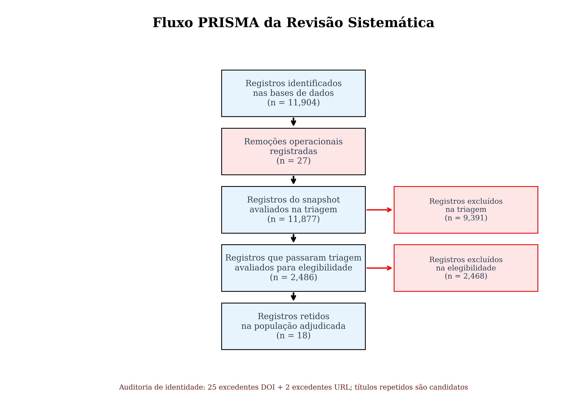
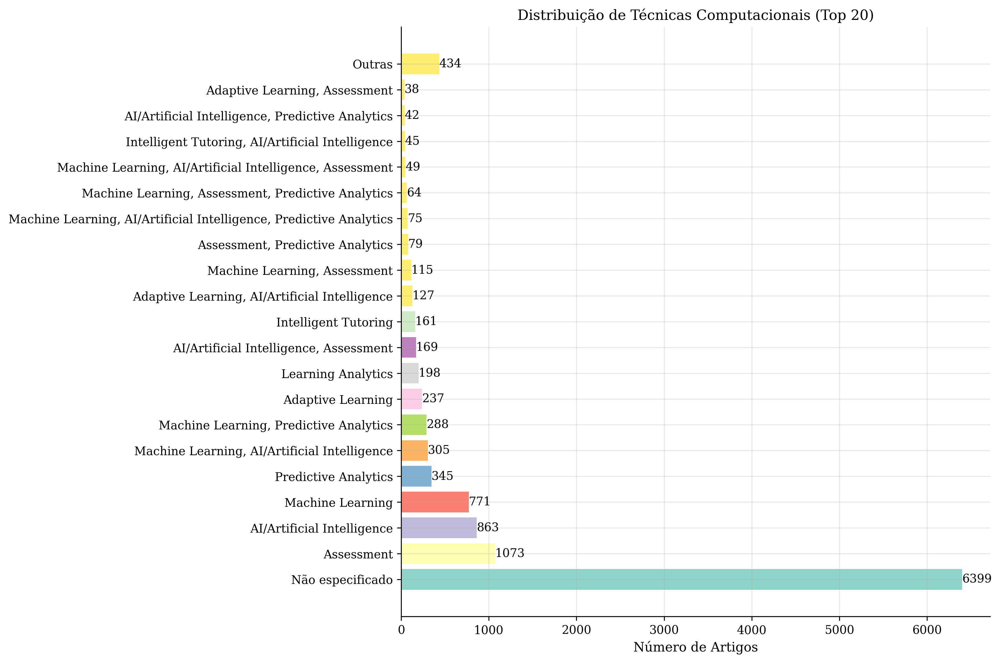
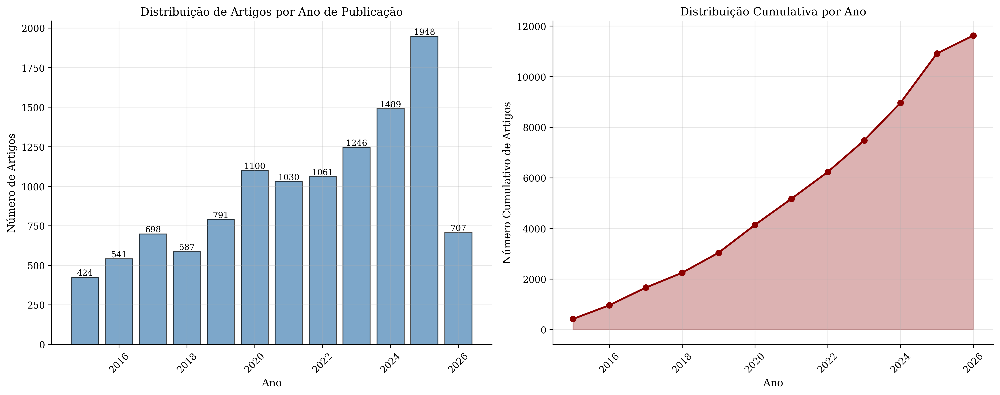
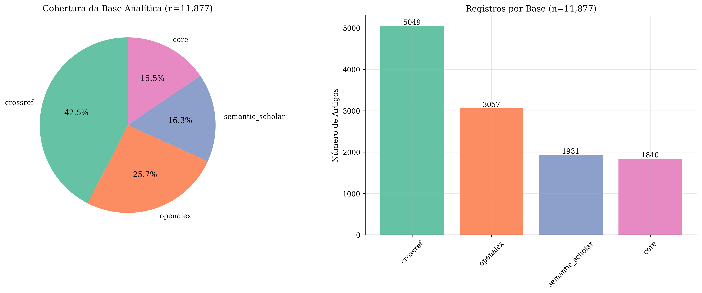
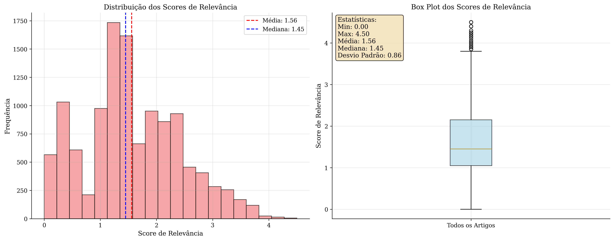

# Ensino Personalizado de Matemática

## Oportunidades e Técnicas Computacionais

 

**Revisão Sistemática da Literatura — relato orientado pelo PRISMA 2020**

 

Thales Ferreira Batista · Ciência da Computação

Prof. Dr. Rafael Zanin (IFC) · Prof. Dr. Manassés Ribeiro (IFC)

IFC — Videira

 

<small>Snapshot adjudicado: 03/09/2026 · recorte temporal: 2015–2026</small>

---
layout: two-cols
---

# Por que esta revisão?

::right::

 

## Problema de pesquisa

Professores lidam com turmas heterogêneas e precisam identificar necessidades de aprendizagem em tempo hábil.

 

## Questão central

Como técnicas computacionais podem apoiar o diagnóstico e a personalização do ensino de matemática?

 

<small>O trabalho mapeia evidências e lacunas. Não apresenta ainda um protótipo validado ou uma estimativa agregada de eficácia.</small>

---

# Perguntas e objetivo

| Pergunta | Foco da revisão |
| --- | --- |
| **RQ1** | Quais técnicas computacionais são aplicadas à educação matemática? |
| **RQ2** | Como essas aplicações são avaliadas em contextos educacionais? |
| **RQ3** | Quais lacunas, limitações e desafios são reportados? |
| **RQ4** | Que direcionamentos podem apoiar ferramentas educacionais mais eficazes? |

 

> Objetivo: mapear e analisar aplicações de *machine learning*, *learning analytics* e sistemas tutores inteligentes na educação matemática, identificando tendências, lacunas e requisitos para uma futura especificação técnica e pedagógica.

---
layout: two-cols
---

# Protocolo e escopo

::right::

### Relato orientado pelo PRISMA 2020

- **Recorte temporal:** 2015–2026
- **Idiomas planejados:** inglês e português
- **Consultas canônicas:** 72 (48 EN + 24 PT)
- **Fontes:** Semantic Scholar, OpenAlex, Crossref e CORE
- **Filtro operacional:** score de relevância ≥ 4,0

 

> O score organiza o processamento. Ele não substitui a adjudicação de escopo, a avaliação metodológica ou a leitura das fontes primárias.

---

# Do registro bruto à população retida

  
<strong>11.904</strong>identificados

  
→

  
<strong>27</strong>remoções determinísticas (25 DOI + 2 URL)

  
→

  
<strong>11.877</strong>na triagem

  
<strong>9.391</strong>excluídos na triagem

  
→

  
<strong>2.486</strong>na elegibilidade

  
→

  
<strong>2.468</strong>excluídos na elegibilidade

  

  
<strong>18</strong>retidos no snapshot

<small>O fluxo atual registra identidade bibliográfica de forma determinística. Igualdade de título permanece como candidato à auditoria semântica, não como remoção automática.</small>

---
layout: center
---

# Fluxo PRISMA do snapshot

<small>Fonte versionada: `research/exports/visualizations/prisma_flow.png`.</small>

---
layout: two-cols
---

# O que a deduplicação significa

::right::

### Leitura correta

- 27 registros foram removidos por identidade DOI/URL.
- Não há remoção automática apenas por igualdade de título.
- Há 232 excedentes apenas por título após a remoção determinística.
- Esses títulos são candidatos a revisão semântica; não equivalem a duplicatas confirmadas.

---

# Panorama descritivo do snapshot

  
<strong>6.399</strong>técnica não especificada

  
<strong>1.073</strong>assessment

  
<strong>863</strong>IA / inteligência artificial

  
<strong>771</strong>machine learning

  
<strong>345</strong>análise preditiva

 

<small>Frequências calculadas sobre os 11.877 registros após remoção determinística. As categorias podem se sobrepor e não representam apenas os 18 retidos, qualidade ou eficácia.</small>

---

# Distribuição temporal e fontes

  

    
    <small>Registros por ano no snapshot versionado.</small>
  

  

    
    <small>Registros associados às quatro fontes consultadas.</small>
  

<small>As visualizações são descritivas; não inferem representatividade, qualidade ou efeito pedagógico.</small>

---
layout: two-cols
---

# Score de relevância: filtro operacional

 

  <h3>Interpretação</h3>
  
O score organiza o processamento automatizado. Ele não é uma medida de qualidade metodológica, não produz ranking e não substitui a leitura das fontes primárias.

---
layout: two-cols
---

# População retida e MMAT

::right::

## 18 registros

- **17** candidatos empíricos provisórios
- **1** protocolo contextual
- O protocolo contextual não sustenta resultado empírico.

 

## MMAT 2018

O ledger atual é uma avaliação por critério, ainda preliminar. A recuperação das fontes, os localizadores e a adjudicação final permanecem necessários.

 

> Portanto, não há nota média, ranking ou conclusão global de qualidade metodológica.

---

# O que podemos concluir — e o que não podemos

  

    <h3>Podemos afirmar</h3>
    
O snapshot oferece um mapa auditável das aplicações encontradas, das etapas de seleção e das lacunas documentadas.

  

  

    <h3>Ainda não podemos afirmar</h3>
    
Que as técnicas sejam eficazes em geral, que exista superioridade entre modelos ou que o protótipo esteja validado em escolas.

  

 

<small>Resultados de estudos individuais devem ser interpretados nas fontes primárias, considerando população, instrumento, métrica e desenho de avaliação.</small>

---

# Reprodutibilidade sem distribuir o SQLite

  
<strong>CSV / JSON</strong>snapshot e ledgers de decisão

  
<strong>BibTeX</strong>referências derivadas do pipeline

  
<strong>Manifesto</strong>hashes e escopo dos artefatos

  
<strong>PNG / HTML</strong>relatórios e visualizações públicas

 

- `research/exports/analysis/papers.csv`
- `research/exports/reports/summary.json`
- `research/exports/reports/reproducibility_manifest.json`

 

<small>A bibliografia derivada do pipeline permanece separada das referências teóricas, pedagógicas, metodológicas e técnicas usadas na fundamentação do TCC.</small>

---

# Próximos passos científicos

1. Consolidar a recuperação das fontes e a adjudicação final do MMAT.
2. Revisar as lacunas à luz dos 17 estudos empíricos provisórios.
3. Especificar o protótipo somente após a decisão de escopo e orientação.
4. Definir protocolo e autorização antes de qualquer validação experimental.

 

> A revisão sistemática fundamenta as próximas decisões; ela não substitui o protocolo do experimento.

---
layout: center
---

# Obrigado

## Perguntas e discussão

 

**Ensino Personalizado de Matemática**

Oportunidades e Técnicas Computacionais

 

<small>Fontes públicas: `/research/exports/reports/summary_report.html` · `/results/tcc/` · `/docs/RECONCILIACAO-POPULACAO-ADJUDICADA-2026-09-03.md`</small>

