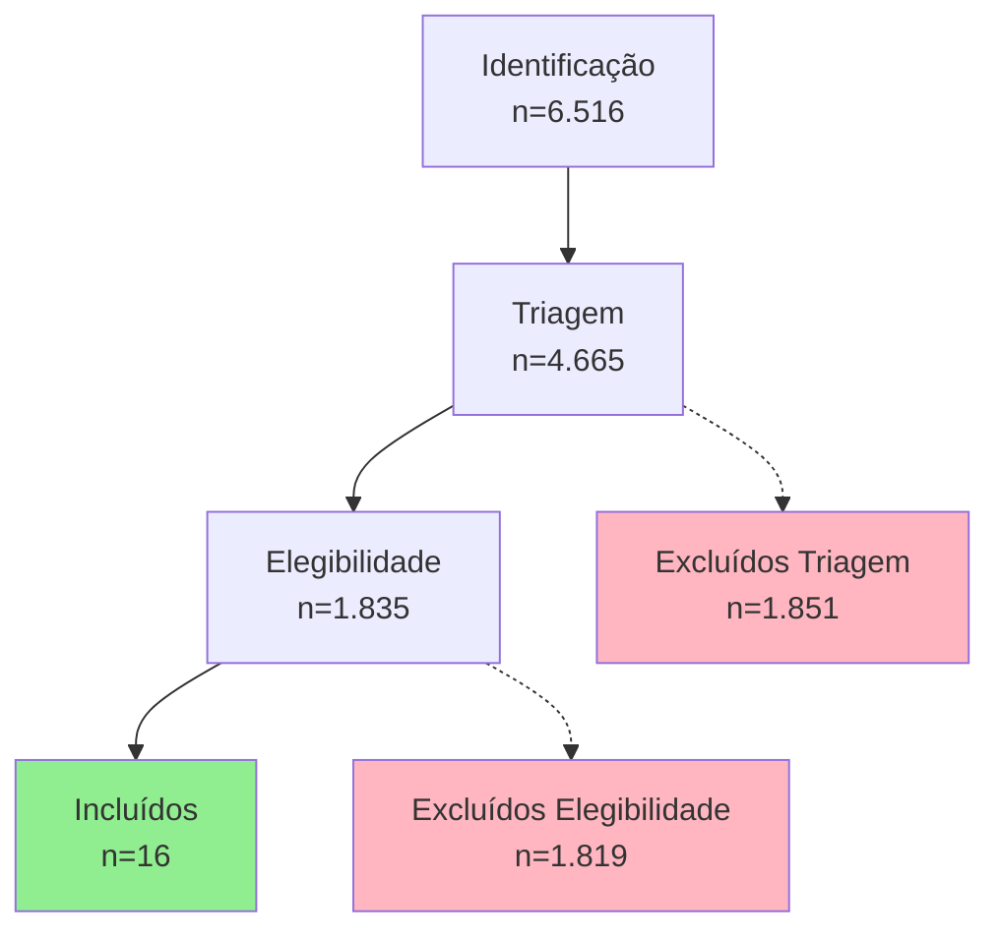

# 🔬 Metodologia de Revisão Sistemática (Atualizada 16/11/2025)

> Consolida a metodologia canônica da Fase 1 após atualização do pipeline. Substitui METODOLOGIA_UPDATED.md. Para estatísticas execute `python -m research.src.cli stats`.

## 📋 Protocolo

Seguimos PRISMA 2020 (Page et al., 2021) com integração multi-API (Crossref, OpenAlex, Semantic Scholar, CORE) e cache SQLite para reprodutibilidade.

### Estratégia de Busca Bilíngue

A estratégia combina três camadas de termos (base matemática, técnicas computacionais, domínio educacional) usando operador booleano `AND`:

**Estrutura (camadas):**
- **Base matemática** (EN): "mathematics", "math" (2 termos)
- **Base matemática** (PT): "matemática" (1 termo)
- **Técnicas computacionais** (ambos idiomas): "adaptive", "personalized", "tutoring", "analytics", "mining", "machine learning", "ai", "assessment", "student modeling", "predictive", "intelligent tutor", "artificial intelligence" (12 termos cada)
- **Domínio educacional** (EN): "education", "learning" (2 termos)
- **Domínio educacional** (PT): "educacao", "ensino" (2 termos)

**Contagem:**
- Inglês: 2 base × 12 técnicas × 2 educacionais = **48 queries**
- Português: 1 base × 12 técnicas × 2 educacionais = **24 queries**
- Total: **72 consultas únicas** (verificado 17/11/2025 em `search_terms.py`)

**Formato**: `"base AND tecnica AND edu"` (ex: `"mathematics AND machine learning AND education"`)

### Fluxo PRISMA (Números atuais)



### Critérios (PICOS)

Population: estudantes de matemática. Intervention: técnicas computacionais (ML, IA, LA, ITS, NLP). Comparison: abordagens tradicionais/alternativas. Outcomes: desempenho, diagnóstico, personalização. Study Design: empírico / quasi-experimental / estudo de caso.

### Processo

1. Identificação: execução automática das 108 queries; coleta estruturada.
2. Deduplicação: DOI + similaridade de título (TF‑IDF coseno >0.9) na ingestão.
3. Triagem: filtros de idioma, período, presença de título/abstract.
4. Elegibilidade: scoring multi-critério (relevance_score 0–10).
5. Inclusão: threshold relevance_score ≥4.0 (resultou em 16 estudos).

### Scoring (resumo)

- Técnicas computacionais (0–3)
- Contexto educação matemática (0–3)
- Qualidade metadados / abstract (0–2)
- Impacto / acesso (0–2)

Inclusão se score ≥4.0.

### Números Derivados

- Exclusões triagem: 1.851 (28,4%)
- Exclusões elegibilidade: 1.819 (99,1%)
- Taxa inclusão: ~0,25%
- Abstracts não vazios: 6.513

### Reprodutibilidade

Banco: `research/systematic_review.sqlite`. Comandos principais:

```bash
python -m research.src.cli run-pipeline --min-score 4.0
python -m research.src.cli stats
python -m research.src.cli export
```

### Limitações

Viés de idioma (EN/PT), ausência de dedup_log histórico, alta taxa de exclusão na elegibilidade refletindo rigor temporal e temático.

### Atualização

Documento regenerado em 16/11/2025 após nova execução completa do pipeline.

### Referências

- Page, M. J., McKenzie, J. E., Bossuyt, P. M., et al. (2021). The PRISMA 2020 statement: an updated guideline for reporting systematic reviews. BMJ, 372, n71. <https://doi.org/10.1136/bmj.n71>

*Para números futuros reprocesse o pipeline e revalide este documento.*
