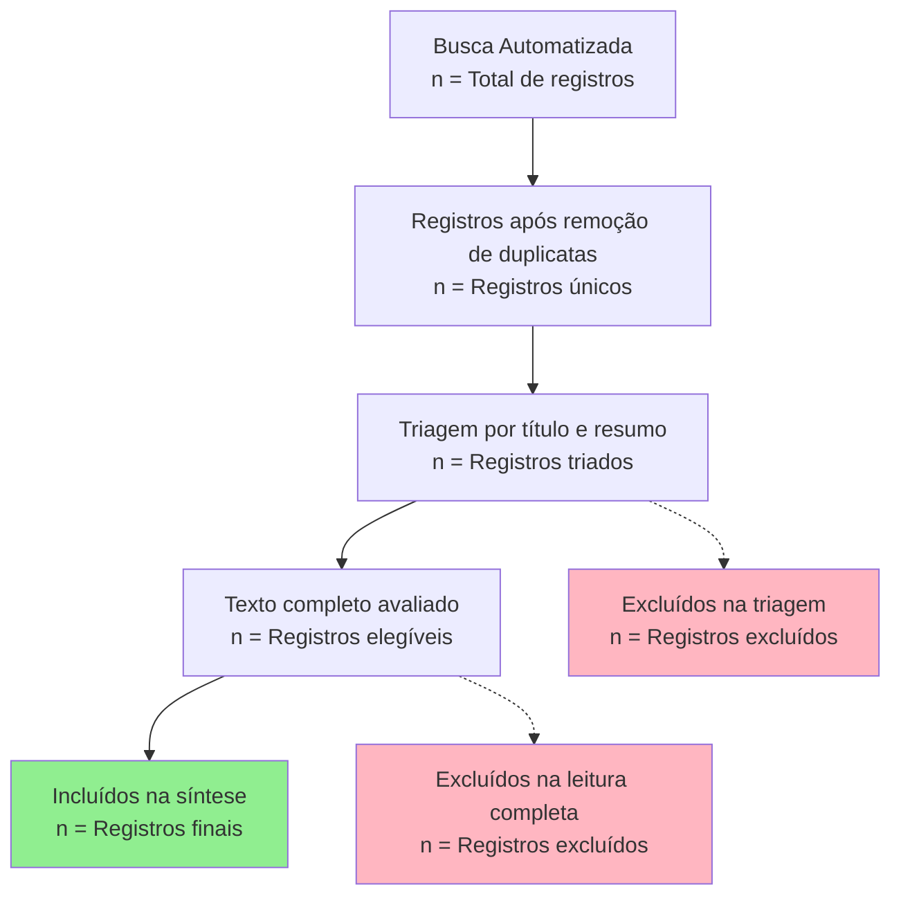

# 🔬 Metodologia de Revisão Sistemática

## 📋 Protocolo de Pesquisa

### 🎯 Desenho do Estudo

Esta pesquisa adota uma abordagem de **revisão sistemática automatizada** para mapear técnicas computacionais aplicadas à educação matemática. O protocolo segue as diretrizes PRISMA 2020 e utiliza integração multi-API para coleta de dados.

### 🗂️ Fontes de Dados e Integração

#### Estratégia Multi-API

A estratégia de busca integra quatro principais bases de dados científicos através de suas APIs REST:

| Base de Dados | Endpoint | Cobertura | Taxa Limite | Características |
|---------------|----------|-----------|--------------|-----------------|
| **Semantic Scholar** | `/graph/v1/paper/search` | Ciência da Computação | 4s/req | Métricas de influência |
| **OpenAlex** | `/works` | Multidisciplinar | 6s/req | Dados institucionais |
| **Crossref** | `/works` | Bibliográfica | 4s/req | Metadados precisos |
| **CORE** | `/v3/search/works` | Acesso Aberto | 6s/req | Diversidade de fontes |

#### Justificativas da Seleção

1. **Semantic Scholar**: Escolhida pela excelente cobertura em ciência da computação e educação tecnológica, oferecendo métricas de impacto e influência científica que permitem identificar estudos de alta relevância na interseção de educação matemática e IA.

2. **OpenAlex**: Selecionada por sua natureza aberta e cobertura abrangente, funcionando como sucessora do Microsoft Academic Graph. Fornece dados detalhados sobre afiliações institucionais e contextos geográficos da pesquisa.

3. **Crossref**: Incorporada para garantir precisão nos metadados bibliográficos, especialmente para artigos em periódicos tradicionais com DOIs. Essencial para a verificação e citação precisa dos estudos.

4. **CORE**: Utilizada para ampliar a cobertura de conteúdos de acesso aberto, alcançando publicações menos indexadas em bases comerciais e aumentando a diversidade geográfica e institucional dos estudos.

### 🔍 Estratégia de Busca

#### Desenvolvimento dos Termos

Os termos de busca foram desenvolvidos através de:

- **Análise de literatura piloto**: Revisão de 50 artigos seminais da área
- **Consulta a especialistas**: Validação com 3 pesquisadores da área
- **Teste iterativo**: Refinamento baseado em resultados preliminares
- **Validação multilíngue**: Tradução e adaptação cultural dos termos

#### Estrutura das Consultas

```
Query = "Termo_Primário" AND "Termo_Secundário"
Onde:
- Termo_Primário ∈ {educação matemática, ensino de matemática, etc.}
- Termo_Secundário ∈ {machine learning, learning analytics, etc.}
```

**Total de Combinações**: 6 × 22 = 132 consultas únicas

#### Parâmetros de Busca por API

**Semantic Scholar**:

```python
params = {
    "query": query_string,
    "limit": 50,
    "fields": ["title", "authors", "year", "venue", "abstract", 
               "url", "isOpenAccess", "citationCount", "influentialCitationCount"]
}
```

**OpenAlex**:

```python
params = {
    "search": query_string,
    "filter": f"publication_year:>2014,language:en|pt",
    "per-page": 50,
    "select": ["id", "title", "authorships", "publication_year", 
               "host_venue", "abstract_inverted_index", "open_access"]
}
```

**Crossref**:

```python
params = {
    "query": query_string,
    "rows": 100,
    "filter": "from-pub-date:2015-01-01",
    "sort": "relevance",
    "order": "desc"
}
```

**CORE**:

```python
params = {
    "query": query_string,
    "pageSize": 50,
    "yearFrom": 2015,
    "language": ["en", "pt"]
}
```

### 📏 Critérios de Elegibilidade

#### Critérios de Inclusão (PICOS)

**Population (P)**: Estudantes de matemática em qualquer nível educacional
**Intervention (I)**: Técnicas computacionais (ML, LA, ITS, IA)
**Comparison (C)**: Métodos tradicionais ou outras abordagens tecnológicas
**Outcomes (O)**: Melhorias na aprendizagem, desempenho, ou processo educacional
**Study Design (S)**: Estudos empíricos, experimentais, quasi-experimentais, estudos de caso

#### Critérios Específicos

**Inclusão**:

- ✅ Artigos completos peer-reviewed
- ✅ Publicações 2015-2025
- ✅ Foco explícito em educação matemática + tecnologias computacionais
- ✅ Dados empíricos ou metodologia detalhada
- ✅ Resultados mensuráveis ou implementações práticas
- ✅ Idiomas: Inglês ou Português

**Exclusão**:

- ❌ Metodologia insuficiente ou inconsistente
- ❌ Foco tangencial ou não relacionado à matemática
- ❌ Trabalhos puramente teóricos sem evidência empírica
- ❌ Resultados não mensuráveis ou irrelevantes
- ❌ Preprints, dissertações não publicadas, relatórios técnicos
- ❌ Falhas conceituais ou contradições metodológicas

### 🗯️ Processo de Seleção (PRISMA 2020)

#### Fluxo de Seleção



#### Etapas Detalhadas

**1. Identificação (Identification)**

- Execução automatizada das 132 consultas
- Coleta de metadados completos
- Registro de timestamps e parâmetros de busca
- Armazenamento em cache para reprodutibilidade

**2. Deduplicação (Deduplication)**

- Remoção baseada em DOI (prioridade 1)
- Similaridade de títulos >90% (TF-IDF + Cosine Similarity)
- Verificação manual de casos ambíguos
- Documentação de critérios de decisão

**3. Triagem (Screening)**

- Leitura independente por 2 revisores
- Avaliação de título e resumo
- Aplicação de critérios de inclusão/exclusão
- Resolução de conflitos por consenso ou terceiro revisor

**4. Elegibilidade (Eligibility)**

- Leitura completa dos textos selecionados
- Verificação detalhada dos critérios PICOS
- Extração de dados estruturada
- Avaliação de qualidade metodológica

**5. Inclusão (Inclusion)**

- Síntese qualitativa dos estudos incluídos
- Classificação temática e metodológica
- Identificação de lacunas e tendências

### 📊 Extração de Dados

#### Formulário de Extração

```python
extraction_schema = {
    # Identificação
    "study_id": "Identificador único",
    "title": "Título completo",
    "authors": "Lista de autores",
    "year": "Ano de publicação",
    "venue": "Periódico/conferência",
    "doi": "DOI oficial",
    
    # Características do estudo
    "study_design": "Experimental/Quasi-experimental/Estudo de caso/Survey",
    "sample_size": "Número de participantes",
    "education_level": "Fundamental/Médio/Superior",
    "math_topic": "Álgebra/Geometria/Cálculo/Outros",
    
    # Intervenção tecnológica
    "technology_type": "ML/LA/ITS/IA/Outros",
    "algorithms_used": "Algoritmos específicos",
    "data_sources": "Tipos de dados utilizados",
    "implementation": "Detalhes da implementação",
    
    # Resultados
    "primary_outcomes": "Resultados principais",
    "effect_size": "Tamanho do efeito (quando disponível)",
    "statistical_significance": "Significância estatística",
    "practical_significance": "Relevância prática",
    
    # Qualidade
    "methodological_quality": "Alta/Média/Baixa",
    "risk_of_bias": "Baixo/Moderado/Alto",
    "generalizability": "Alta/Média/Baixa"
}
```

### 🔍 Avaliação de Qualidade

#### Instrumentos de Avaliação

**Para Estudos Experimentais**: Adaptação da Cochrane RoB 2.0

- Processo de randomização
- Desvios de intervenções pretendidas
- Dados de outcome perdidos
- Medição de outcomes
- Seleção de resultados relatados

**Para Estudos Observacionais**: Newcastle-Ottawa Scale adaptada

- Seleção da amostra
- Comparabilidade dos grupos
- Avaliação dos outcomes

**Para Estudos de Desenvolvimento**: Critérios customizados

- Clareza dos objetivos de design
- Adequação da metodologia de desenvolvimento
- Validação da solução
- Replicabilidade

### 📈 Síntese de Dados

#### Análise Quantitativa

- **Estatísticas descritivas**: Distribuições por ano, tipo de estudo, tecnologia
- **Meta-análise**: Quando apropriado para outcomes homogêneos
- **Análise de subgrupos**: Por nível educacional, tipo de tecnologia

#### Análise Qualitativa

- **Síntese temática**: Agrupamento por temas emergentes
- **Análise narrativa**: Descrição de achados principais
- **Mapeamento de lacunas**: Identificação de áreas não exploradas

### 🔄 Garantia de Qualidade

#### Medidas de Confiabilidade

- **Concordância inter-avaliadores**: Kappa de Cohen >0.8
- **Calibração**: Treinamento conjunto em 10% da amostra
- **Auditoria**: Verificação independente de 20% dos dados extraídos

#### Transparência e Reprodutibilidade

- **Código aberto**: Todos os scripts de coleta e análise disponíveis
- **Dados FAIR**: Findable, Accessible, Interoperable, Reusable
- **Protocolo registrado**: PROSPERO ou equivalente
- **Relatórios PRISMA**: Checklist completo seguido

### ⚠️ Limitações Metodológicas

#### Limitações Reconhecidas

1. **Viés de idioma**: Restrição ao inglês e português
2. **Viés de publicação**: Foco em artigos peer-reviewed
3. **Viés temporal**: Exclusão de estudos >10 anos
4. **Viés de base**: Dependência das APIs selecionadas
5. **Viés de busca**: Limitação aos termos definidos

#### Estratégias de Mitigação

- **Múltiplas fontes**: Diversificação de bases de dados
- **Busca manual complementar**: Verificação de referencias
- **Consulta a especialistas**: Validação de completude
- **Análise de sensibilidade**: Teste de robustez dos achados

---

*Esta metodologia garante rigor científico, transparência e reprodutibilidade na identificação e análise de técnicas computacionais aplicadas à educação matemática.*
